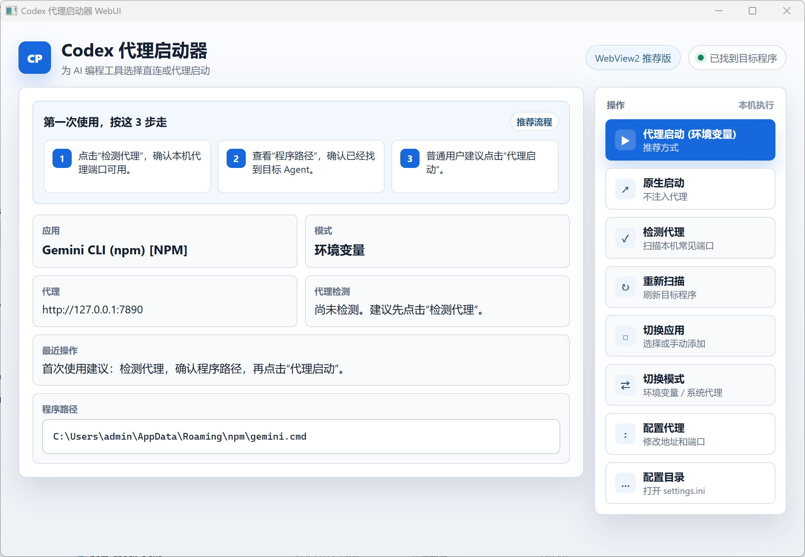
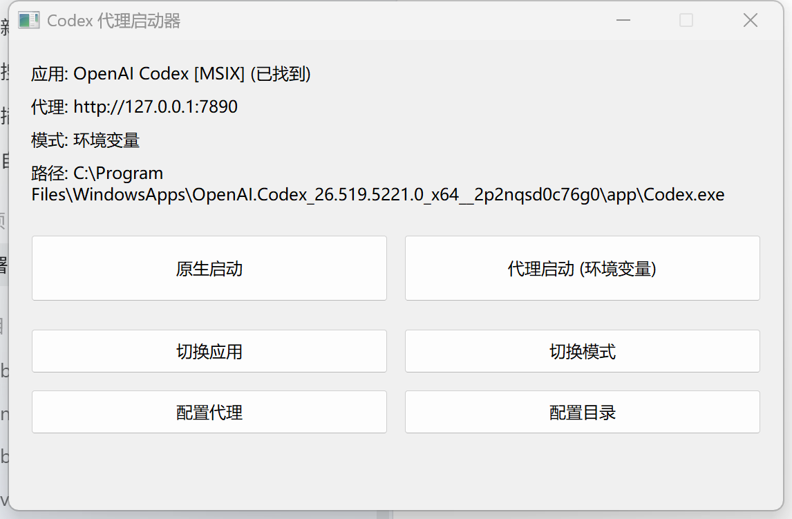

# App Proxy Switcher for Windows

[中文](README.md) | [English](README.en.md)

A lightweight Windows proxy launcher for AI coding tools. It can start Codex, Claude, Gemini, Copilot, Cline, Roo Code, and similar tools in direct mode or proxy mode.

This repository is derived from [hloolx/codex-proxy-switcher-win](https://github.com/hloolx/codex-proxy-switcher-win). This version refactors and slims down the MIT-licensed source into a C++17 Win32 native app, removes the .NET runtime dependency, supports statically linked x64 builds, and expands discovery for desktop apps, npm CLIs, and VS Code ecosystem code agents.


## Which Build Should I Download?

Most users should download the **WebView2 build**. It has the clearest interface, first-run guidance, proxy check results, full program paths, and the latest action status.

| Build | Best for | Notes |
| --- | --- | --- |
| `AppProxySwitcher-WebView2-x64.zip` | Most users | Recommended UI; requires Microsoft Edge WebView2 Runtime |
| `AppProxySwitcher-Win32-x64.zip` | Older machines or smallest size | Lightweight fallback with the core launch workflow |
| Single `.exe` | Advanced users | Portable executable only |

If unsure, choose the WebView2 build. Most Windows 10/11 systems already include the WebView2 Runtime.

## Download and Run

Prebuilt executables are not committed to the repository. Download the static x64 build from GitHub Releases:

- [AppProxySwitcher-WebView2-x64.zip](https://github.com/yufangjie1643/app-proxy-switcher-win/releases/download/v2.3.1/AppProxySwitcher-WebView2-x64.zip)
- [AppProxySwitcher-Win32-x64.zip](https://github.com/yufangjie1643/app-proxy-switcher-win/releases/download/v2.3.1/AppProxySwitcher-Win32-x64.zip)
- [CodexProxySwitcher-webview2-x64.exe](https://github.com/yufangjie1643/app-proxy-switcher-win/releases/download/v2.3.1/CodexProxySwitcher-webview2-x64.exe)
- [CodexProxySwitcher-win32-x64.exe](https://github.com/yufangjie1643/app-proxy-switcher-win/releases/download/v2.3.1/CodexProxySwitcher-win32-x64.exe)

Unzip the package and run `CodexProxySwitcherWebView2.exe` or `CodexProxySwitcher.exe`. On first launch, the app reads or creates its config and shows the detected target program path.

## Screenshots

Recommended WebView2 build:



Lightweight Win32 build:



## First Use

1. Start your proxy client, such as Clash, Mihomo, V2RayN, or another local proxy app.
2. Click **Check Proxy**. The app only scans local common ports such as `7890`, `7897`, `1080`, `10808`, `10809`, `8080`, `8118`, and `8888`; it does not run a remote network test.
3. Confirm that the program path is detected, then click **Launch with Proxy**.

If another local port is open, the app asks whether to switch to that address, for example `http://127.0.0.1:7890`.

## If the App Is Not Found

Use the recovery actions instead of guessing:

1. Click **Rescan**.
2. Click **Switch App** and choose a detected tool, or manually select an exe.
3. Click **Config Folder** and inspect the current configuration.
4. Confirm the target tool is installed and available for the current user.

Program paths wrap across multiple lines, so you can verify the exact exe or script being launched.

## Proxy Modes

| Mode | Recommendation | Scope |
| --- | --- | --- |
| Environment variables | Recommended | Only affects the launched tool; injects `HTTP_PROXY`, `HTTPS_PROXY`, `ALL_PROXY`, and `NO_PROXY` |
| System proxy | Use carefully | Changes Windows Internet Options and affects browsers and other apps until disabled |

Use environment-variable mode by default. Try system proxy mode only when the target tool ignores proxy environment variables.

## Built-in Detection

- Desktop apps: OpenAI Codex Desktop, Claude Desktop.
- npm CLIs: `@openai/codex`, `@anthropic-ai/claude-code`, `@google/gemini-cli`, `@qwen-code/qwen-code`, `opencode-ai`, `@sourcegraph/amp`.
- VS Code ecosystem: OpenAI Codex / ChatGPT, GitHub Copilot Chat, Continue, Cline, Roo Code, Kilo Code, Gemini Code Assist, Amazon Q, Augment Code, Windsurf / Codeium, Sourcegraph Cody, Tabnine.

## Build from Source

Requirements:

- Windows 10/11 x64
- Visual Studio 2022 with Desktop development with C++
- CMake 3.16+
- Microsoft Edge WebView2 Runtime for the WebView2 build; the build script downloads the WebView2 SDK into `build/_deps/`

One-command build:

```bat
build.bat
```

Manual build:

```bat
powershell -NoProfile -ExecutionPolicy Bypass -File scripts\Fetch-WebView2.ps1
cmake -S . -B build -G "Visual Studio 17 2022" -A x64 -DBUILD_WEBVIEW2=ON
cmake --build build --config Release
```

Outputs:

```text
build/bin/CodexProxySwitcher.exe          lightweight Win32 build
build/bin/CodexProxySwitcherWebView2.exe  recommended WebView2 build
```

Use `-DBUILD_WEBVIEW2=OFF` for a Win32-only build. Release builds use the MSVC static runtime `/MT`, so they do not require an extra VC++ Runtime installation.

## Testing

```bat
cmake --build build --config Release --target app_finder_tests
ctest --test-dir build -C Release --output-on-failure
```

Tests cover Appx parsing, npm command mapping, VS Code extension parsing, the built-in tool list, legacy config migration, DPI window sizing, and local proxy port detection.

## Security Notes

- The app does not collect telemetry or upload user configuration.
- Proxy detection only checks local TCP ports and does not access remote websites.
- Current release builds are unsigned, so Windows SmartScreen may warn before launch.
- Settings are stored in `%APPDATA%\CodexProxySwitcher\settings.ini`.
- This project is not officially affiliated with OpenAI, Anthropic, Microsoft, Google, or other tool vendors.

## Project Structure

```text
src/                 C++17 / Win32 source
tests/               lightweight regression tests
scripts/             PowerShell helper scripts
docs/images/         README screenshots
CMakeLists.txt       CMake build configuration
build.bat            one-command build script
```

## Source and License

This project is a refactored derivative of the MIT-licensed [hloolx/codex-proxy-switcher-win](https://github.com/hloolx/codex-proxy-switcher-win). Keep the upstream copyright and license notice when redistributing or modifying it.
